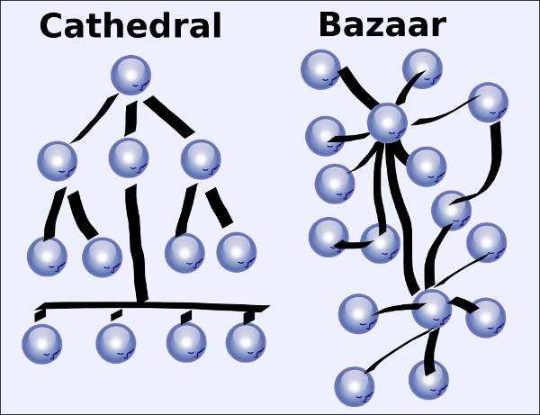

= Projet Personel en Humanités
:author: Alexis DUQUE
:email: <alexis.duque@insa-lyon.fr>
:date: 01/03/2015
:toc: hello
:toc-placement: preamble
:toc-title: Sommaire
:icons: font
:doctype: book
:stylesheet: pph.css

[float]
:numbered!:
== Le logiciel libre et leurs communautés peuvent-ils contribuer à un monde meilleur ?

<<<

:numbered:
== Motivation et problématique

image:images/gsoc.png[Google Summer of Code]

Le Projet Personnel en Humanités, effectué dans le cadre d’études d’ingénieur
de second cycle à l’INSA de Lyon, est un travail de réflexion personnelle et de
documentation sur un thème libre. J'ai donc choisit de le réaliser sur un sujet
auquel j'accorde une importance  particulière et qui a un impacté de façon non négligeable
mon évolution : le logiciel libre et les communautés open-source.

En 2014, en participant au programme Google Summer Code, j'ai eu l'opportunité
de rejoindre la communauté du projet OpenMRS.

OpenMRS est une plateforme de collecte de données médicales (EMR), libre, gratuite et utilisées dans de nombreux pays du
tiers monde.
L'origine de ce projet remonte à 2004, lorsque deux bio-informaticiens de l'Université
d'Indianapolis ont démarré le développement d'un modèle de données, visant à
améliorer la lutte contre le SIDA en Afrique subsaharienne. Dix ans après, le
projet rassemble une communauté de près de 150 contributeurs actifs et 3000
utilisateurs dans le monde.

La nature humanitaire de ce projet, qui d'ailleurs m'a incité à le rejoindre,
ainsi que mon implication croissante,  m'ont poussé à me questionner sur l'impact
 et l'influence qu'un tel projet, et plus généralement les logiciels libres pouvaient
 avoir sur la société et le monde actuel.

Pour comprendre les raisons de cette réflexion, je reviendrais sur les origines et
la raison d'être du logiciel libre avant d'analyser comment il a influencé et
influence actuellement notre société, en m'appuyant notamment sur des exemples concrets.

<<<

== Le logiciel libre

Commençons par un rapide retour en arrière, au tout début de l'informatique et
la naissance du logiciel.

Avant 1977, il existait un très fort lien entre le matériel vendu et le logiciel
qui était livré avec les machines. Les constructeurs de matériel achetaient aux
éditeurs leurs logiciels avec tous les droits. Ceci était compréhensible
puisqu’à l’époque, le logiciel était vu comme un produit d'ingénierie et non
comme une oeuvre intellectuelle comme maintenant.

En parallèle à cela, beaucoup de logiciels étaient développés et distribués
 dans le monde de la recherche pour
des utilisations spécifiques et n'appartenaient à personne et étaient utilisés
par tous.

C’est en 1977 que tout change quand Bill Gates et Paul Allen demandent
de recevoir chacun 3000 dollars chacun pour leur interpréteur BASIC, l’Altair
BASIC. En plus de ces 3000 dollars, ils négocient une licence de 35 dollars pour
chaque machine distribuée par le constructeur doté de leur interpréteur. Ainsi Microsoft « inventa » le marché
du logiciel propriétaire.

=== Le logiciel libre, le commencement

Durant les années 80, l’internet grand public naquit et facilita les
transmissions d’informations entre les individus. Internet permit surtout à
certains passionnés d’informatique de monter des projets communs en dépit de
l’éloignement géographique.

Très vite, de nombreux logiciels gratuits apparurent
et furent disponible au grand public, cependant, il restait difficile de
partager le code source de ces logiciels puisqu’il était impossible de garantir
que le code source d’une application ne serait pas repris par un éditeur et
vendu au détriment des auteurs légitimes de ce code. Une première avancée dans
ce domaine a été faite par l’Université de Berkeley qui a publié une licence, la «
Berkeley Software Distribution Licence » abrégée «BSD licence», qui était un
moyen de rapprocher son code du domaine public. Il était alors légal de
distribuer le code et de le modifier.

Cependant rien ne pouvait garantir le libre accès au code source, car rien n’obligeait
de donner un accès au code source lorsqu’on modifiait significativement le code source d’un logiciel. C’est
un problème qui perdura jusqu’au milieu des années 80 jusqu’à ce qu’un homme
fasse tout basculer.

=== La « Free Software Foundation » inventeur du libre

C’est en 1986 que Richard Stallman fonda la « Free
Software Foundation » et posa la définition du logiciel libre.
Sellons les règles de la FSF, un logiciel pour être qualifié de libre
doit respecter ces quatre libertés :

****

- Liberté d’exécuter le programme, pour tous les usages.
- Liberté d’étudier le fonctionnement du programme, et de le modifier pour qu’il
fasse votre travail informatique comme vous le souhaiter. Pour ceci, le code
source  est une condition requise.
- Liberté de redistribuer des copies et donc d’aider votre voisin.
- Liberté de distribuer aux autres des copies de vos versions modifiées.
 En faisant cela, vous pouvez faire profiter toute la communauté de vos
 changements. L’accès au code source est une condition requise.
****

Après avoir posé ces règles, il fallait ensuite proposer un moyen pour garantir
le droit des auteur de logiciel à partager sans risque leur code. C’est en 1989
que R. Stallman créa la «GNU General Public Licence» ou GNU GPL. Cette licence
était destinée à unifier les licences d’utilisation des projets GNU (GNU Emacs,
GNU C Compiler...) cependant, cette licence fut vite utilisée par d’autres
projets indépendants des projets GNU. A ce moment-là, le logiciel libre tel que
nous le connaissons aujourd’hui est né. La GNU GPL, l’OVNI des licences et
apogée du libre.

La GNU GPL, à son édition et même maintenant, reste une licence très importante
dans le monde de l’informatique, car c’est la seule licence qui garantit un
héritage sur les nouvelles versions de logiciel, c’est à dire que toute nouvelle
version d’un logiciel sous licence GNU GPL doit être distribuée sous cette
licence et avec les mêmes contraintes de partage de code source. C’est cette
clause de la licence qui la rend plus intéressante que les autres licences de
partage et qui permet d’instaurer une communauté de développeurs qui sont
capables de faire avancer des projets faramineux. C’est la première licence à
pousser la notion de «Copyleft» à son paroxysme et de s’opposer au copyright,
c’est-à-dire que la licence GPL est la première licence à permettre à un auteur
de renoncer à ses droits de propriété.

Pour pouvoir comprendre l’originalité de la licence GNU GPL, faisons un petit
tour d’horizon de ce qui se fait en dehors des licences totalement restrictives
des logiciels propriétaires.

=== Licences et domaine public

On entend surtout parler du domaine public pour des œuvres littéraires ou
musicales, mais les mêmes lois s’appliquent au logiciel. Ce n’est pas à
proprement parler d’une licence, mais reste un moyen de faciliter le partage.

Ainsi, un logiciel du domaine public doit avoir son code accessible à tous. Il
peut être modifié, redistribué sans contraintes. Cependant, cette méthode n’est
pas utilisée, et ceci pour plusieurs raisons. L’informatique étant une science
très récente, il est difficile de trouver des logiciels dont leur auteur est
mort depuis plus de 70 ans et donc dont le code source bascule automatiquement
dans le domaine public. Les seuls logiciels du domaine public existent, car leurs
propriétaires ont abandonné leurs droits sur ceux-ci. De plus, rien n’assure que
le code source ne sera pas modifié puis fermé au profit d’un éditeur quelconque.
Enfin la législation du domaine public varie selon les pays et peut entrer en
conflit avec les idéaux de partage. Ces raisons ont poussé des éditeurs à écrire
d’autres licences, plus contraignantes. La «Berkeley Software Distribution
licence» ébauche du libre.

image:images/bsd.png[alt="BSD", role="right", height="200", width="200"]

Dans les années 70, les chercheurs de l’Université de Berkeley cherchent un
moyen simple de distribuer à la communauté scientifique le code source de leur
logiciel, ils inventèrent donc une licence qui s’approche très fortement des
clauses du domaine public Américain, la licence BSD (Berkeley Software
Distribution licence). À la différence du domaine public, elle permet entre autres
de protéger les auteurs en empêchant l’emploi de leur nom dans des produits
dérivés et les décharge si un éventuel problème survenait lors de l’utilisation
de leur logiciel comme une perte de donnée... Il est à noter que du code source
sous licence BSD peut être incorporé à une solution propriétaire, le meilleur
exemple de cela est l’utilisation du code en provenance de FreeBSD dans le
système d’exploitation Mac Os X. Autre chose, cette licence est compatible avec
la licence GNU GPL c’est-à-dire que du code écrit sous licence BSD peut être
distribué (après modification ou non) sous licence GNU GPL, car celle-ci est plus
restrictive, et par conséquent l’inverse n’est pas possible, car Dossier CTC :
L’industrie du libre la licence BSD
ne comporte pas de clause sur la visibilité du code redistribué.

=== Libre ou gratuit ?

Ici il est très important de distinguer le logiciel libre du logiciel gratuit.
Le gratuiciel est un logiciel propriétaire, mais distribué gratuitement, le code
source de ces logiciels n’est pas disponible et il est interdit d’essayer de
l’obtenir sans l’accord de l’auteur et encore moins de le modifier. Le
gratuiciel est de moins en moins utilisé pour des grands projets, mais demeure
utilisé pour de petites applications. Le partagiciel ou shareware

Un partagiciel est un logiciel distribué gratuitement à des fins de test, il est
propriétaire et se présente essentiellement sous deux formes. Une version bridée
gratuite qui est là pour montrer son utilité, et si l’utilisateur est convaincu,
il doit payer pour débrider son logiciel et utiliser toutes les fonctionnalités
ou bien les partagiciels sont des versions complètes, mais qui ne peuvent
s’utiliser que sur une période limitée. ils est aussi, comme pour les
gratuiciels, interdit de le modifier et les sources sont fermées.

Il devient maintenant plus facile de comprendre ce pour quoi le logiciel libre a
été pensé, il s’agissait d’un moyen de mettre à disposition de tous des outils
efficaces et facilement évolutifs.

<<<
== Un atout pour notre société

Les logiciels libres sont, il faut l’avouer, très peu connus du très grand
public au sens ou beaucoup de gens achètent une machine avec un système
propriétaire et achètent la suite logicielle du même éditeur puis ne jurent que
par celle-ci. Cependant il peut être très avantageux de passer au « tout open-source ».
Il est dommage de se cantonner à cette vision, car il existe une alternative
libre à presque tous les logiciels propriétaires sauf cas spéciaux par
exemple les logiciels spécialisés de CMAO (Conception Mécanique Assistés par
Ordinateurs) et il suffit parfois d’une petite recherche sur internet pour
trouver exactement le logiciel qu’il nous faut.

=== Un logiciel accessible à tous

Le plus grand atout des logiciels libres est leur accessibilité puisqu'ils
 sont tout bonnement gratuits. Prenons un exemple, la version boite du système
d’exploitation de la firme de Redmond coûte pour une édition familiale 200€
tandis que Linux est gratuit. Certains diront que de toute façon personne
n’achète de version boite, car le système est livré sur tout nouvel ordinateur et
qu’il serait bête de perdre une licence de ce logiciel que nous achetons en la
remplaçant par une version de Linux. Ceux-là oublient que tout constructeur de
matériel ou assembleur doit mettre en place un service de remboursement de
licence de logiciels propriétaires pour les logiciels livrés par défaut avec la
machine.

Un autre argument en faveur des logiciels libres est leur facilité
d’utilisation. Beaucoup d’éditeurs de logiciel libre ont travaillé sur
l’ergonomie de leur logiciel et proposent des moyens simples d’installer un
logiciel et de l’utiliser. La notion de «User Friendly» se retrouve énormément
dans la description de distribution Linux telle qu’Ubuntu ou Mint.

Au niveau fonctionnalités, les logiciels libres mettent en œuvre efficacement
tout ce qui se fait de mieux dans le monde propriétaire malgré leur interface
parfois vielle-école et une certaine habitude à prendre pour les utiliser.

=== Un avantage pour la sécurité informatique

On peut parler d’une sécurité accrue dans le cas de logiciel libre car comme
leur code source est visible aux yeux du monde entier et il est donc plus
difficile d’y cacher un code malveillant. De plus, les utilisateurs avancés sont
capables de déceler des bogues lors d'exécutions hasardeuses et faire
remonter énormément d’information sur la manière de remédier au problème et
facilitent ainsi l’évolution et la pérennité du logiciel. Imaginons un instant,
nous téléchargeons un logiciel gratuit de gestion de finances, par manque de
chance, l’éditeur de ce logiciel est malveillant et profite du fait que nous
entrons nos coordonnées bancaires pour envoyer sur un serveur à l’étranger des
informations sur notre compte en banque, nos sites web favoris et autres
informations présentes sur le disque dur. Il peut se passer beaucoup de temps
avant que l’on se rende compte de ces problèmes surtout si le logiciel fait ce
pour quoi il a été conçu, c’est-à-dire dessiner des courbes de dépenses,
prévision de budgets... Tandis qu’une version libre sera forcément relue et ces
actions de récupération de données personnelles seront visibles.

Une autre conséquence d’avoir un code source disponible est qu’il est alors plus
facile de faire venir de nouveaux développeurs dans la communauté, car ils
peuvent s’auto former sur le code source avant de rejoindre une équipe de
développeur. Ainsi le fait qu’un logiciel soit libre auto-entretient son
développement et lui assure une pérennité dans le temps. De plus le
développement est relativement facilité par le nombre d’utilisateurs qui
représente une force de testeur quasi illimitée. Une technique fortement
pratiquée par certains éditeurs de logiciel est de distribuer leur logiciel de
manière libre, de recueillir les rapports d’erreurs et des commentaires sur
comment combler des failles de sécurité puis d’améliorer leur produit avant de
le vendre sur le marché avec une licence propriétaire, une licence est parfois
offerte aux bêta testeurs.

=== Un moteur pour l'innovation

La réalisation d’un logiciel libre est une
sorte de défi pour ses créateurs, celui de faire le mieux. La nouveauté et
l’aspect innovateur du logiciel sont donc essentiels à sa création. C’est, de
plus, l’un des aspects qui va motiver et éveiller l’intérêt des différents
acteurs qui participent à sa réalisation.

L’aspect défi, recherche, est un
élément fondateur de la conception du logiciel. Cela fédère les créateurs autour
de ce but commun, de cette passion partagée et génère un enthousiasme général
favorable au travail. La liberté d’accès aux sources permet à chacun de modifier le
logiciel afin de le faire évoluer et de le parfaire. Cette liberté dans la
réalisation laisse libre cour à la création et à l’imagination qui va dans ce
domaine, de pair avec la pointe de la technologie.

Ce constat est développé dans la conclusion des débats de l’OpenWorldForum 2009 et notamment souligné par
Michael Tiemann (Vice President of Open Source Affairs at Red Hat Inc, as well
as President of the Open Source Initiative.).

=== Une source de savoir universelle

Un autre atout du logiciel libre est de générer une base de savoir commune et
accessible à tous (à l’image de Wikipédia dont le succès n’est plus à prouver).

Au-delà de création d’un « patrimoine universel public », c’est un bénéfice évident pour l'éducation. Les
établissements d'enseignement de tous niveaux doivent utiliser et enseigner le
logiciel libre, car seul celui-ci leur permet de remplir leurs missions
essentielles : diffuser le savoir et préparer les élèves à être de bons membres
de leur communauté.

Le code source, ainsi que les méthodes du logiciel libre,
font partie des savoirs humains, alors qu'au contraire le logiciel privateur
fait intervenir un savoir secret, fermé. On peut donc affirmer qu'il est une aide
à l'éducation, quand le logiciel privateur l'interdit.

=== Un modèle humainement et socialement enrichissant

Les hommes sont les racines du développement du logiciel libre ; ce qui peut
sembler étonnant, c'est que la plupart des développeurs ― que l'on devrait
appeler « Hackers », la récente signification n'étant qu'un amalgame diffusé
par les médias ― programment pendant leurs temps libres, en soirées ou le
week-end. Ils ne programment pas dans un but intéressé économiquement, mais
pour le développement de leur logiciel et de la communauté.

Raymond, un des grands « philosophes du libre », qui se dit aussi «
anthropologue extra-terrestre », affirme la chose suivante : « Tout bon logiciel
commence par gratter un développeur là où ça le démange ». C'est en effet la
principale cause de la réussite du logiciel libre : les gens qui le développent
sont motivés, car ils ont un besoin ou une certaine envie de réaliser et aiment
ce qu'ils font : « Pour résoudre un problème intéressant, commencez par trouver
un problème qui vous intéresse. ». Ils ne sont pas poussés à le faire, comme
peuvent l'être des développeurs dans une entreprise commerciale.

Eric Raymond dans son essai *« Cathedral and the bazaar »* donne ainsi beaucoup de conseils
tirés d'une longue étude du phénomène Linux et de ses propres expériences. Il
montre que les développements libres (qui sont du style « bazar », car
d'apparence anarchique et désorganisée) sont plus efficaces que leurs équivalents
commerciaux (du style « cathédrale » car rigide, droit, ne publiant au monde
que des versions des logiciels (re)-travaillées et (re)-vérifiées pendant de
longs tests). Cette domination du logiciel libre sur le commercial pourrait être
le fait de la nécessaire considération du talent d'autrui dans les projets
libres : « Il est presque aussi important de savoir reconnaître les bonnes idées
de vos utilisateurs que d'avoir de bonnes idées vous-même. C'est même
préférable, parfois ».

Il conseille ainsi de réellement s'ouvrir aux autres et
de déléguer au maximum les tâches : « Traiter vos utilisateurs en tant que
codéveloppeurs est le chemin le moins semé d'embûches vers une amélioration
rapide du code et un débogage efficace » et « Si vous traitez vos bêta-testeurs
comme ce que vous avez de plus cher au monde, ils réagiront en devenant
effectivement ce que vous avez de plus cher au monde. » ― pour précisions, un
bêta-testeur est la personne qui teste le logiciel lorsqu'il n'est pas encore
dit « stable », donc lorsqu'il peut rester des problèmes, des bugs à corriger ;
dans ce cas le bêta testeur essaie de trouver les bugs et le recense au(x)
développeur(s).

=== Une opportunité pour les pays en voie de développement

Depuis quelques années on constate que les pays en voie de développement
utilisent fortement les logiciels libres.
C'est le cas par exemple de la Chine, où le gouvernement encourage l'utilisation
de Linux.

==== Rendre les logiciels accessibles aux plus pauvres

Le coût de reproduction des logiciels est pratiquement nul, Internet ayant rendu
les communications peu coûteuses partout dans le monde. Le coût essentiel est
celui du développement.

Dans ces conditions, il paraîtrait légitime de
distribuer les logiciels pour un coût modique aux pays les plus pauvres.
Cela ne diminuerait en rien les revenus des éditeurs, les utilisateurs dans les
PVDs n'ayant pas les moyens d'acheter les logiciels dont ils ont besoin et les
piratant souvent. Cette situation n'est pas sans rappeler celle des médicaments
génériques.

Les logiciels libres constituent donc un formidable espoir pour les pays en voie
de développement. Ils ont grâce à eux la possibilité d'accéder à des logiciels
de haute qualité technique pour un prix minimal. Ils constituent également un
témoignage concret de la possibilité pour les pays riches de faire preuve de
solidarité dans le domaine de la
technologie.

==== Réduire le retard technologique des PVDs

Les projets Open Source constituent une véritable université universelle et
gratuite de la programmation. Ils peuvent permettre aux PVDs de rattraper plus
rapidement leur retard technologique dans le secteur des logiciels.
Les sources étant librement disponibles, cela constitue pour tous ceux qui
veulent relever leur niveau en programmation une occasion idéale d'apprendre
les dernières techniques.

D'autre part, il est très facile aux informaticiens des
PVDs de participer à des projets Open Source, ceux-ci étant ouverts aux
programmeurs de toutes origines.

==== Subventionner les projets Open Source

Pour ces raisons, on peut penser qu'il serait souhaitable de faire
subventionner le développement de logiciels Open Source par les pouvoirs
publics dans le cadre de l'aide aux pays en voie de développement.
Dans ce cadre, on pourrait en particulier favoriser les projets de
développements de logiciels destinés aux PME ou aux particuliers plutôt que
ceux destinés aux grandes entreprises. On pourrait également favoriser les
projets ayant un contenu éducatif permettant de faciliter l'apprentissage de
l'informatique par les participants du projet.

=== Le logiciel libre pour sauver des vies

==== Ameliorer l'informatique médicale
image:images/openmrs.svg[caption="OpenMRS", title="OpenMRS", alt="OpenMRS",
 width="400", height="200"]

J'ai découvert le projet OpenMRS en février 2014 à l'occasion de la
publication des projets acceptés au Google Summer of Code.
Le Google Summer of Code est un projet annuel de Google qui vise à promouvoir le
développement des logiciels libres chez les étudiants. Ainsi, chaque année
pendant la période estivale, pas moins de 1000 étudiants sont rémunérés par
Google et invités à participer au développement du logiciel libre depuis leur
domicile. Les projets participant au GSoC sont au nombre d'une centaine.
De grands noms du libre y participent, de Mozilla à la distribution Linux Ubuntu.

Je souhaitais alors m'engager comme contributeur dans une
communauté depuis quelque temps, mais pour plusieurs raisons, je n'avais pas
encore franchi le pas : comment m'intégrer, quel projet choisir, tels étaient
mes questions. Le GSoC était donc l'occasion parfaite. Une sélection de projets, un mentor,
une visibilité au sein de la communauté, un projet assigné.
Le choix fut assez rapide, car mes critères étaient assez précis : un projet à
dimension humanitaire, une communauté suffisamment importante, bien documenté.
Après la sélection de mon projet par les responsables de la communauté, j'ai donc
rejoins le projet OpenMRS en tant que "Google Summer of Code Student".

===== "Write Code, Save Life"

OpenMRS est un donc outil collaboratif visant à développer des solutions logicielles
pour appuyer la prestation de soins de santé dans les pays en développement.

Au départ, le projet est né de la nécessité impérieuse d’enrayer la progression
dramatique du virus du Sida en Afrique. Il s’agissait de promouvoir le suivi
médical grâce à un système de dossiers médicaux électroniques adaptés à la gamme
complète de soins médicaux. C’est de Paul Biondich et Burke Mamlin, de
l’Institut Regenstrief (dans l’Indiana), que l’idée du projet OpenMRS fut
lancée, suite à une visite en 2004 à Eldoret au Kenya.

À cette époque, Hamish Fraser dirige déjà un projet similaire nommé PIH-EMR, un
système internet de dossiers médicaux, destiné pour sa part à combattre la
tuberculose au Pérou et le VIH en Haïti rural. Les deux équipes se rencontrent
la même année à San Francisco, à l’occasion de la conférence Medinfo, et se
rendent compte que leurs projets partagent la même philosophie. C’est ainsi
qu’OpenMRS est né, par la mise en commun des intérêts et des compétences de
chacun. Plus tard, Chris Seebregts, du Conseil sud-africain de recherche
médicale, viendra se joindre au projet pour en devenir le quatrième membre
fondateur.

Techniquement, OpenMRS est un système de données très ouvert conçu pour être
utilisable dans des environnements pauvres en ressources. Son aspect libre et
flexible lui permet d’être adapté à de nouveaux contextes et à de nouvelles
données de santé, sans recourt à la programmation. C’est donc une plateforme
facilement accessible que peuvent utiliser librement les organisations
humanitaires ou les ONG, comme Medecins Sans Frontières, en partant quasiment de zéro.

OpenMRS est distribué sous licence  » OpenMRS Public License » (basé sur la
licence Mozilla Public License). Il a été développé en Java et utilise une base
de données MySQL (avec migration possible sur d’autres bases de données via
Hibernate). Il possède des outils d’exportation de données et de reporting.

Aujourd'hui la communauté de développeurs (150 environs) est organier autour
d'une dizaine de "core developers", qui travaillent à plein temps sur le projet, soit
détachée par leur entreprise ou fondation, soit salariée par l'Institut Regenstrief.

OpenMRS a ainsi été utilisé à plusieurs reprises pour réagir rapidement aux
épidémies et a récemment lancé une initiative pour développer la plateforme afin
d’endiguer l’épidémie d’Ebola.

==== Gérer les catastrophes naturelles

===== L'exemple du typhon Haiyan
image:images/openstreetmap.png[Open Street Map, role="left", width="150"]

La forte mobilisation de la communauté OpenStreetMap après le passage du
terrible typhon Haiyan aux Philippines en Novembre 2013 a fourni une aide précieuse à la
Croix-Rouge sur le terrain.

Des bénévoles à travers le monde ont en effet construit une infrastructure
géo-numérique pour aider l’organisation des secours aux victimes du typhon.
Une collaboration
humanitaire mondiale et massive rendue possible par le biais d’Internet.
qui a permis la réalisation de cartes détaillées des zones touchées par le typhon
Haiyan, qui n’existait lorsque le typhon a frappé.

C'est ainsi, plus de 400 contributeurs qui se sont mobilisés et ont effectué près de 750 000 ajouts sur
la carte en ligne libre des Philippines et de ses environs. Elle reflète l’état de la carte avant le passage du typhon, et a aidé les sauveteurs de la Croix-Rouge et les bénévoles à prendre des
décisions cruciales afin de savoir où envoyer de la nourriture, de l’eau , des
équipements.

Il est très facile ici d’exagérer, mais il est très probable qu’aux Philippines,
 les données et logiciels de cartographie libres — ainsi que la
communauté qui les supporte — à sauvé des vies.

===== Le Wikipédia des cartes

Les changements ont été faits dans OpenStreetMap (OSM), une sorte de
Wikipédia des cartes. OSM se veut être une carte complète du monde, libre
d’utilisation et modifiable par tous. Créée en 2004, la plateforme a
maintenant plus d’un million d’utilisateurs.

La Croix-Rouge, à l’échelle internationale, a commencé récemment à utiliser des
logiciels et des données libres au sein de ses différents projets. Les
logiciels libres réduisent ou éliminent les coûts cachés, ou le montant
nécessaire pour que les choses continuent de fonctionner après le départ de la
Croix-Rouge. N’importe quel logiciel ou donnée issue de la Croix-Rouge est
aujourd’hui sous licence libre ou Creative Commons.

===== Comment des données cartographiques ont-elles pu aider la croix rouge ?

Tout d’abord, elles ont permis d’imprimer sur place des
cartes en utilisant les données d’OSM pour ensuite les redistribuer sur le
terrain. La Croix-Rouge américaine a envoyé quatre responsables de haut niveau
aux Philippines, et parmi eux, Helen Welch, une spécialiste de la gestion de
l’information, a apporté avec elle plus de 50 cartes papier décrivant la ville
de Tacloban et d’autres zones fortement touchées.

Ces cartes ont été imprimées avant que les volontaires n’aient fait
la majorité des changements dans les zones concernées sur OSM. En les comparant
avec les nouvelles cartes imprimées sur le terrain, les secouristes ont pu
retrouver plus facilement l'emplacement des bâtiments détruit et en déduire les
emplacements potentiels des victimes.

OSM n’est pas la seule organisation à solliciter l’aide de volontaires en ligne
afin d’aider les Philippines  : MicroMappers, dirigé par un vétéran des efforts
d’OSM en Haïti, a également fait des appels à des bénévoles pour trier des
tweets, et ainsi déterminer les zones où les secours étaient les plus
nécessaires.

<<<

== Une influence négative sur le monde

Les logiciels libres présentent d’incroyables possibilités, mais ne sont pas
exempts de problèmes. Ainsi, penser qu'ils sont une solution universelle aux
problèmes de notre planète serait une utopie.

=== L'envie de donner et de partager écrase-t-elle la culture de la gloire personnelle ?

Les développeurs du libre partagent ils leurs travaux car
ils adhèrent intégralement à la politique de libération du logiciel menée par la
FSF ou est-ce plus simplement pour se faire connaître de la communauté ? Il est
certain que les 2 points sont valables, le degré d'appréciation dépendant de
chaque développeur. Nombreux sont ceux qui publient leur logiciel sous licence
GPL car ils sont reconnaissants de ce mouvement, ils sont conscients que les
logiciels libres les ont aidés à progresser : le source étant disponible on peut
étudier le code, et quand il est bien écrit, en tirer de nombreux enseignements
et s'améliorer largement de cette manière. Il est aussi très valorisant pour
l'esprit de savoir qu'une de ses productions est utile à des personnes, qu'elle
leur économise du temps et leur facilite la vie ; voir que son logiciel est
apprécié et devient indispensable pour les utilisateurs : cela est vraiment
gratifiant pour un développeur. Lorsque c'est le cas, il est évident qu'une
certaine gloire émerge, ou plus généralement une reconnaissance par la
communauté, et se forge alors une réputation qui peut, dans le cas de produits
phares, être un tremplin important dans le marché du travail. Ce fut par exemple
le cas pour Linus Torvalds qui après avoir réalisé Linux fut employé par
l'université d'Helsinki, puis par la suite employé par Transmeta qui lui proposa
un excellent poste au sein de sa structure. Le cas de Torvalds est loin d'être
une exception, les expériences dans le logiciel libre étant des atouts très
appréciés sur les CV.

De manière plus générale, pour Linus Torvalds (avis que
je partage très largement) : « la plupart des bons programmeurs ne programment
pas parce qu'ils s'attendent à un salaire ou à être adulés par les foules, mais
parce qu'on s'amuse en programmant ». Ce fait est reconnu de tous les
programmeurs du monde libre : programmer un outil dont on a besoin, se faire
aider des autres et avoir le sentiment d'aider les autres est un jeu vraiment
plaisant ― et les joueurs sont de plus en plus nombreux...

=== Une diversité nuisible

Il n'est pas rare dans le domaine du libre que plusieurs solutions différentes
soient développées pour un même problème. Ainsi, il y a une forte concurrence
entre les logiciels libres eux-mêmes. Il arrive aussi parfois que des projets se
divisent, et que deux branches du même logiciel se forment et soient développées
par deux groupes de programmeurs qui ont une vision différente des orientations à
prendre pour le développement de ce logiciel. Par conséquent, la rentabilité
globale du développement de ces logiciels s'en trouve affectée, puisque la
solution au problème initial est développée plusieurs fois, et si l'utilisateur
dispose d'un choix accru, ce choix peut être relativement difficile à prendre.
En effet, l'utilisateur doit dans ce cas se baser sur des critères techniques ou
politiques qui ne l'intéressent normalement pas.

Le travail d'intégration des différents logiciels libres est donc considérable,
et constitue un point faible face aux solutions globales dont on dispose
naturellement dans un environnement monopolistique. Ce travail est généralement
effectué par les différentes «  distributions  » Linux, et implique de manière
détournée une dépendance vis-à-vis de l'éditeur de cette distribution.

=== Les conséquences d'un projet mal documenté.

Les programmeurs préfèrent généralement le développement de leur
programme à l'écriture des documentations. Le fait que le code source soit libre
est souvent prétexte à ne pas le documenter. Il en résulte que les documentations des
logiciels libres sont parfois incomplètes, obsolètes ou pires, inexistantes.
Elles ne sont par ailleurs pas toujours d'une qualité exceptionnelle ni
lisible, sauf dans le cas de petits documents épars et souvent redondants. Il
est donc parfois difficile de trouver des documentations à la fois cohérentes,
complètes, à jour et de qualité. Il est aussi à noter que les programmeurs du
libre restent des passionnés et n’ont pas forcément les moyens (financiers ou
humain) de développer toutes les fonctions d’un logiciel propriétaire.

Ainsi, on constate que la documentation, à destination des utilisateurs, mais aussi
contributeurs est bien souvent un point clé du succès au développement d'une
communauté et du logiciel libre.

=== Des problèmes économiques

Il est parfois impossible de vivre de l'édition des logiciels libres. En
effet, du fait que ces logiciels peuvent être redistribués librement par
quiconque, les auteurs indépendants de logiciels libres ne peuvent prétendre à
une facturation du fruit de leur travail. Les revenus obtenus relèvent dans ce
cas de simples contributions, qui généralement ne permettent pas de survivre.
De fait, la plupart des gens utilisent gratuitement ces logiciels libres et
seulement une proportion infime des utilisateurs fait un effort financier. Par
conséquent, les modèles économiques utilisés dans le domaine du libre sont
souvent plus complexes que dans le cas des logiciels propriétaires. Les
éditeurs sont obligés de facturer des services ou des produits complémentaires
(formation, aide, produits dérivés, personnalisation de leur produit pour un
client, diffusion privilégiée des nouvelles versions, licences doubles pour
les bibliothèques de programmes diffusées sous la licence GPL et que les
clients veulent utiliser dans leurs programmes propriétaires, etc.). Vivre du
libre est donc nettement plus difficile que de fermer le code source du
logiciel et de contraindre le client à financer le développement du produit.

Ces penchants négatifs du logiciel libre sont à relativiser car de plus en
plus d’équipes de développement sont financées par de grosses entreprises,
notons l’exemple de Google qui donne beaucoup d’argent pour le développement
de Mozilla Firefox. Une évolution aussi dans les us du logiciel libre, comme
de plus en plus d’entreprises se mettent au libre, il participent
indirectement au développement du libre en concevant par leurs équipes IT des
solutions à des problèmes pas encore résolus par des équipes de développement.

<<<

== Conclusion
La découverte de l'open-source à travers ma participation au Google Summer of Code
au sein d'OpenMRS, m'a poussé à m'interroger sur sa place et son importance, aussi bien
dans le milieu de l'informatique, qu'à plus grande échelle dans la société actuelle.

Même si l'open-source présente certaines limites que nous avons décrites, il est incontestablement
un moyen de faire "bouger les choses", d'améliorer le monde, voire de sauver des vies.
On le voit bien avec des projets comme OpenMRS, ou bien Open Street Map.

De plus, les communautés open-source sont une source de bénévoles mobilisables rapidement à l'échelle planétaire.
Ce fut par exemple le cas lors du typhon Hayan ou de la pandémie Ebola.

C'est par ailleurs un levier au développement d'une idée, d'un logiciel. Lors des prémisses
d'OpenMRS, la question s'est posée du modèle de développement et de financement, pour
concrétiser le projet. Projet universitaire, ou faire appel à une ESN n'étaient pas viables, par manque de financement
et ne garantissant ni l'évolution, ni la pérennité du projet. La solution de
l’open-source fut donc préférée et l'on voit bien aujourd'hui, 11 ans après, qu'elle fut la bonne.

Pour terminer, je souhaite remercier Burke Mamlin, pour son "mentoring" et son support
presque quotidien lors du GSoC 2014. C'est incontestable qu'il m'a permis de progresser
à différents niveaux, intellectuellement en stimulant ma curiosité, mais également humainement.

<<<

[bibliography]
[left]
Bibliographie
------------

[bibliography]
[float]
.Ouvrages
- Eric Steven Raymond. The Art of Unix
Henry Chesbroug. Open innovation : the new imperative for creating and profiting from technology. Harvard Business School Press
- Eric Raymond, Bob Young. The Cathedral & the Bazaar. O'Reilly,‎ 2001.
- Chris DiBona, Mark Stone, Danese Cooper. Open Sources 2.0, the Continuing Evolution
O'Reill, October 2005.

[bibliography]
.Articles
- ZSCHOCH, Marc. The Success of Open Source. Canadian Journal of Political Science/Revue Canadienne de Science Politique, 2007, vol. 40, no 1, p. 250–252.
- ALMARZOUQ, Mohammad, ZHENG, Li, RONG, Guang, et al. Open source: Concepts, benefits, and challenges. Communications of the Association for Information Systems, 2005, vol. 16, no 1, p. 37.
- MORGAN, Lorraine et FINNEGAN, Patrick. Benefits and drawbacks of open source software: an exploratory study of secondary software firms. In : Open Source Development, Adoption and Innovation. Springer US, 2007. p. 307-312.
- Ivan Gayton : « Faire une carte peut sauver des vies ». La Croix. 16/12/2014.
- Geoffroy Husson : « OpenStreetMap est un projet de cartographie collaborative comparable à Wikipedia ». Le Monde. 12/06/2012.

[bibliography]
.Sites Web
- OpenMRS.org. Disponible sur: <http://openmrs.org> (Consulté le 10.05.2015).
- OpenStreetMap.org. Disponible sur: <http://openstreetmap.org> (Consulté le 10.05.2015).
- Maria Korolof, 10 reasons why open source is eating the world.
Disponible sur: <http://www.networkworld.com/article/2363941/software/156185-10-reasons-why-open-source-is-eating-the-world.html> (Consulté le
  10.01.2015).
- Richard Stallman, Why Schools Should Exclusively Use Free Software.
Disponible sur: <https://www.gnu.org/education/edu-schools.en.html> (Consulté le
  10.01.2015).
- Richard Stallman, Les logiciels libres au secours de la vie privée.
Disponible sur: <http://www.futuremag.fr/animation/richard-stallman-les-logiciels-libres-au-secours-de-la-vie-privee-free-software-NSA-cybers%C3%A9curit%C3%A9-data> (Consulté le
    11.06.2015).
- Médecins Sans Frontières. Google builds a new tablet for the fight against Ebola.
Disponible sur: <http://www.wired.com/2015/03/google-builds-new-tablet-fight-ebola> (Consulté le
04.03.2015).
- Google Summer of Code. Disponible sur: <https://www.google-melange.com/gsoc> (Consulté le
04.03.2015).

